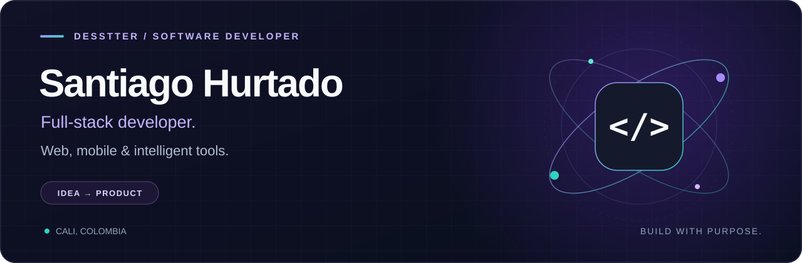

  

  <strong>From a real problem to a working product.</strong> 
  Full-stack development · Android · AI integrations 
  Cali, Colombia 🇨🇴 · 6+ years building web, mobile & automation solutions

  
  
  

  <a href="https://moonhellal.com">My website ↗</a> &nbsp;·&nbsp;
  <a href="#selected-work">Selected work</a> &nbsp;·&nbsp;
  <a href="#toolbox">Toolbox</a> &nbsp;·&nbsp;
  <a href="#lets-build-something-useful">Work with me</a>

---

## Hi, I'm Santiago

I build software from the database to the interface: web applications, Android apps and automation tools. I enjoy turning complex workflows into products people can understand and use.

My projects span construction management, personal finance, AI-assisted document generation and interactive learning. I work mainly with **TypeScript, React, Python and Kotlin**, choosing the stack that fits the problem.

Outside client work, I build things I use myself: a MIDI piano tutor, a typing trainer and physics visualizations. Curiosity usually becomes a new repository.

## Selected work

Six projects that show how I build across business software, mobile development and creative interfaces.

<table>
  <tr>
    <td width="50%" valign="top">
      <h3>01 · HYR</h3>
      
<strong>Business workflows, connected.</strong>

      
A construction management system bringing personnel, payroll, projects, expenses and reporting into one application.

      
<code>Next.js</code> <code>Express</code> <code>PostgreSQL</code>

      
<a href="https://github.com/Desstter/hyr">Explore the project →</a>

    </td>
    <td width="50%" valign="top">
      <h3>02 · Automatic Finances</h3>
      
<strong>Less entry. More clarity.</strong>

      
An Android finance app that turns bank notifications into categorized transactions, with AI-assisted voice entry and spending analytics.

      
<code>Kotlin</code> <code>Jetpack Compose</code> <code>Room</code> <code>Gemini</code>

      
<a href="https://github.com/Desstter/Automatic-Finances">Explore the project →</a>

    </td>
  </tr>
  <tr>
    <td width="50%" valign="top">
      <h3>03 · CV Generator</h3>
      
<strong>AI with a review step.</strong>

      
Tailor a CV to a job description using multiple AI providers, with claim checks, document previews and PDF export.

      
<code>Python</code> <code>FastAPI</code> <code>LLM APIs</code> <code>PDF</code>

      
<a href="https://github.com/Desstter/cvgenerator">Explore the project →</a>

    </td>
    <td width="50%" valign="top">
      <h3>04 · Wave Physics Visualizer</h3>
      
<strong>Make the equations visible.</strong>

      
Explore wave propagation, reflection and material interaction through live simulations, adjustable controls and rendered equations.

      
<code>React</code> <code>TypeScript</code> <code>D3.js</code> <code>KaTeX</code>

      
<a href="https://github.com/Desstter/wave-physics-viz">Explore the project →</a>

    </td>
  </tr>
  <tr>
    <td width="50%" valign="top">
      <h3>05 · Piano MIDI Maestro</h3>
      
<strong>Practice meets the browser.</strong>

      
An interactive piano tutor with MIDI input, sampled piano audio and exercises for notes, chords, scales and intervals.

      
<code>JavaScript</code> <code>Web MIDI</code> <code>Web Audio</code>

      
<a href="https://github.com/Desstter/piano-midi-maestro">Explore the project →</a>

    </td>
    <td width="50%" valign="top">
      <h3>06 · TypeForge</h3>
      
<strong>A small tool with a clear purpose.</strong>

      
A self-contained typing trainer with accuracy-based progression, targeted drills and local progress storage. Runs offline with no dependencies.

      
<code>HTML</code> <code>CSS</code> <code>Vanilla JavaScript</code>

      
<a href="https://github.com/Desstter/typeforge">Explore the project →</a>

    </td>
  </tr>
</table>

<a href="https://github.com/Desstter?tab=repositories">Browse all public projects ↗</a>

## Toolbox

  
  
  
  
  
  

| Area | Technologies I work with |
| :--- | :--- |
| **Web interfaces** | React · Next.js · Vue.js · Tailwind CSS · Vite |
| **APIs & data** | Node.js · Express · FastAPI · PostgreSQL · .NET |
| **Android** | Kotlin · Jetpack Compose · Room · Coroutines |
| **AI & automation** | LLM API integrations · Python · Document generation |
| **Interactive experiences** | D3.js · Canvas · Web Audio · Web MIDI |
| **Delivery** | Git · GitHub Actions · Linux · Caddy · PM2 |

  
<strong>More projects & experiments</strong>

  - [Nails](https://github.com/Desstter/nails) — Salon management with Next.js and TypeScript.
  - [Massage Therapy App](https://github.com/Desstter/massage-therapy-app) — Interactive anatomy and technique reference.
  - [Juego de la Suerte](https://github.com/Desstter/juego-de-la-suerte) — Explore effort and luck through a candidate scoring simulator.
  - [NASA API](https://github.com/Desstter/nasa-api) — A JavaScript explorer for NASA's open APIs.
  - [Countries API](https://github.com/Desstter/countries-api) — Explore country data through a REST API.

---

## Let's build something useful

I'm open to **full-time, freelance and remote opportunities** involving web development, Android or automation. If you have a product to build or a workflow to simplify, let's talk.

**[moonhellal.com](https://moonhellal.com)** · **[Connect on LinkedIn](https://www.linkedin.com/in/santiagohurtadolopez)** · **[sanhurtadolopez@outlook.com](mailto:sanhurtadolopez@outlook.com)**

Santiago Hurtado · Desstter · Cali, Colombia

